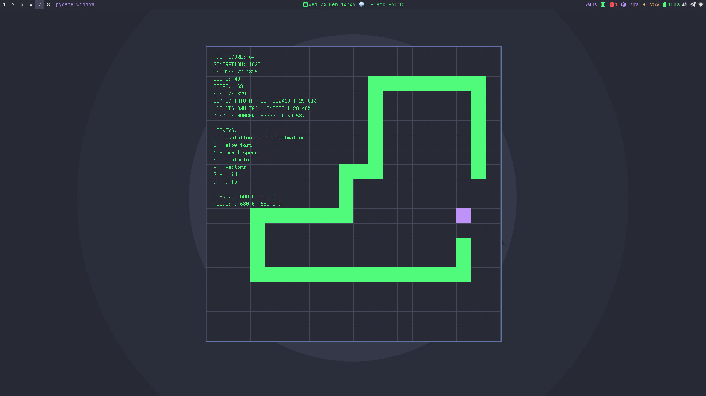
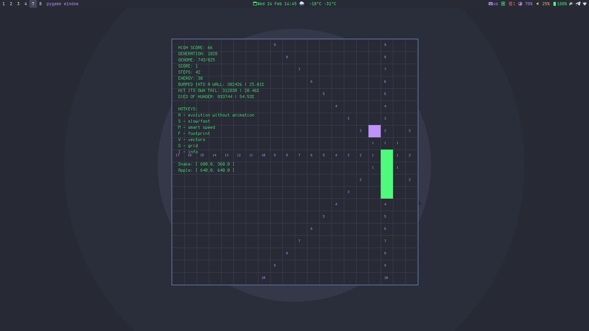

# ИИ для змейки

## В двух словах

Небольшой эксперимент с генетическими алгоримами и нейросетью.

## Подробнее

В этой работе я использовал генетические алгоритмы и простейшую нейронную сеть чтобы научить змейку самостоятельно находить яблоки.

Рекорд 66 яблок.

## Где посмотреть?

<https://github.com/exynil/classic-snake-ai>

## Скриншоты

### На пути к рекорду

### Видимые секторы змейки

