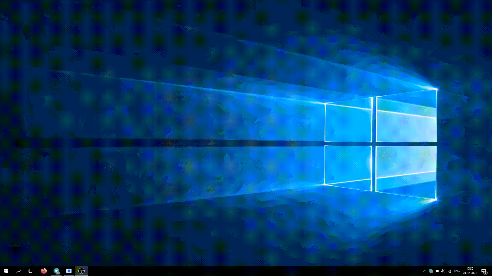
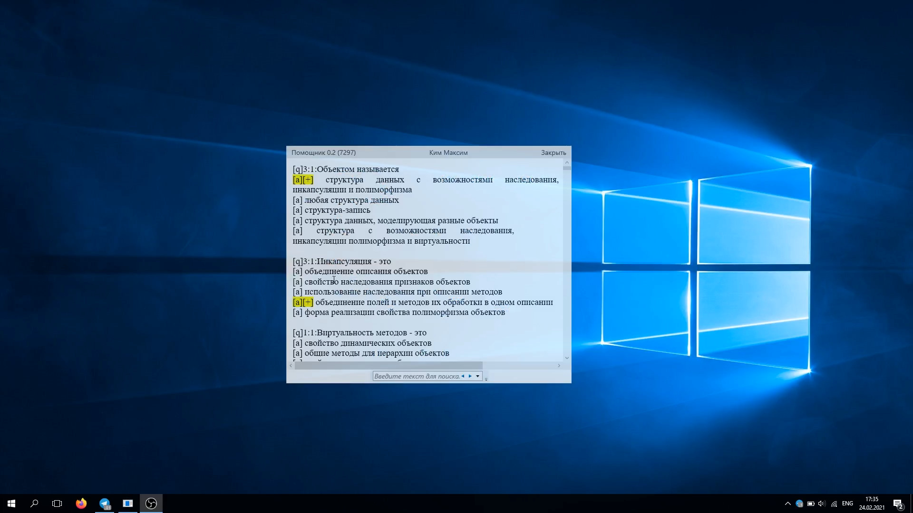

# Помощник

## В двух словах

Программа шпаргалка для списывания ответов.

## Подробнее

Программа написана в помощь мне и моим друзьям сдавать тесты на экзаменах. У меня в университете при сдаче тестов, блокируется доступ к операционной системе программой тестирования. Она перекрывает все обычные окна и это не позволяет студенту открывать браузер или любую другую программу для списывания. Моя программа при наведении мыши, всплывает поверх программы тестирования. Она имеет очень высокую прозрачность, ее спокойно видит студент, но не видит преподаватель издалека. При отведение мыши, программа моментально скрывается. Все что требуется от студента, предварительно подготовить документ шпаргалку для программы и запустить ее перед тестированием.

## Где посмотреть?

<https://github.com/exynil/Helper>

## Скриншоты

