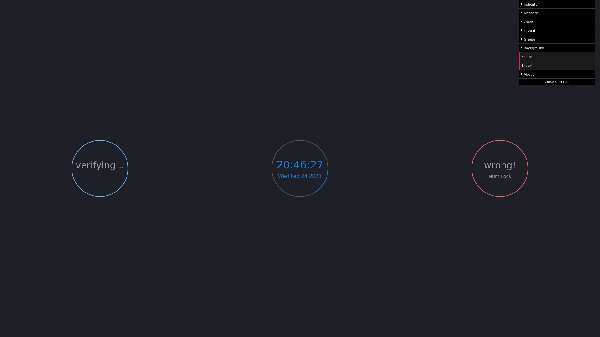
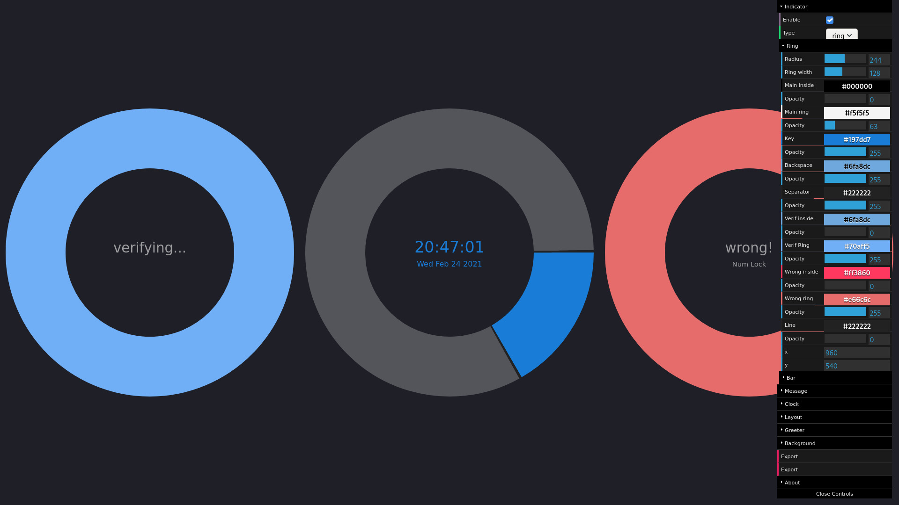

# i3lock editor

## В двух словах

Графический редактор i3lock-color

## Подробнее

i3lock-color это блокировщий системы для X11 в GNU/Linux. Настраивать его очень кропотливое занятие, потому мне захотелось сделать визаульный редактор в помощь сообществу. Редактор позволяет полностью изменять внешний вид экрана блокировки и генерировать конфигурацию в двух удобных вариантах.

## Где посмотреть?

<https://github.com/exynil/i3lock-editor>

## Скриншоты

