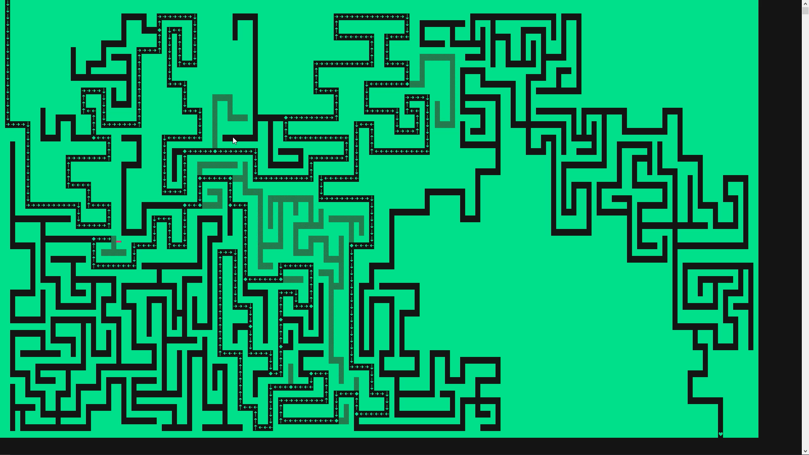
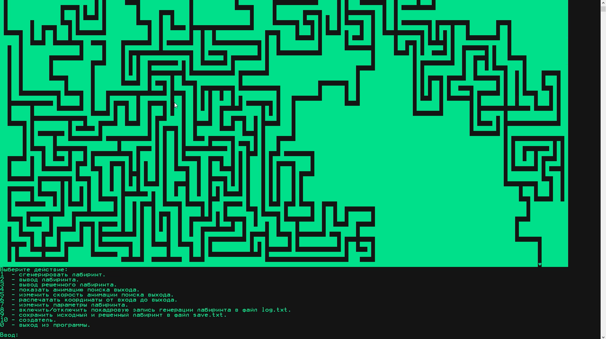

# Лабиринт на С++

## В двух словах

Генератор лабиринтов на C++ работающий в консоли

## Подробнее

Экзаменационное задание по C++ в Компьютерной Академии ШАГ.

Возможности:
- Геренирация лабиринтов
- Решение лабиринтов
- Сохранение лабиринтов в файл

## Где посмотреть?

<https://github.com/exynil/labyrinth-cpp>

## Скриншоты

