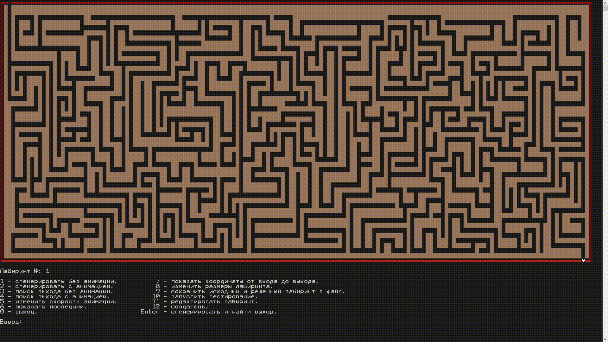
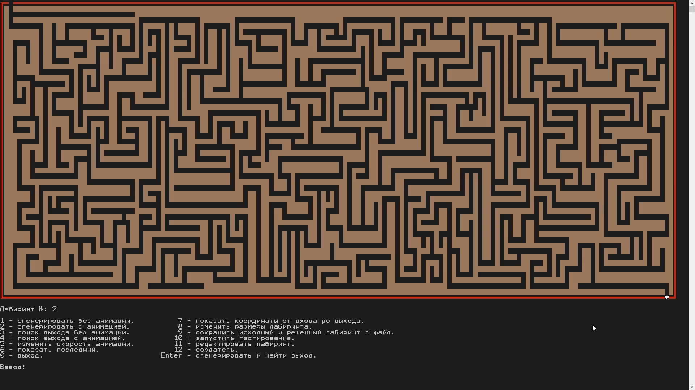

# Лабиринт на C#

## В двух словах

Генератор лабиринтов на C++ работающий в консоли

## Подробнее

Переписал генератор лабиринтов с C++ на C#

Возможности:
- Геренирация лабиринтов
- Решение лабиринтов
- Сохранение лабиринтов в файл
- Редактор лабиринтов

## Где посмотреть?

<https://github.com/exynil/labyrinth-cpp>

## Скриншоты

