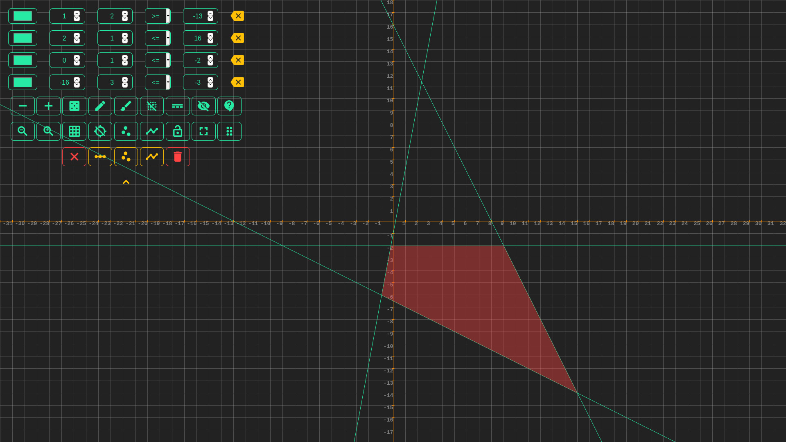
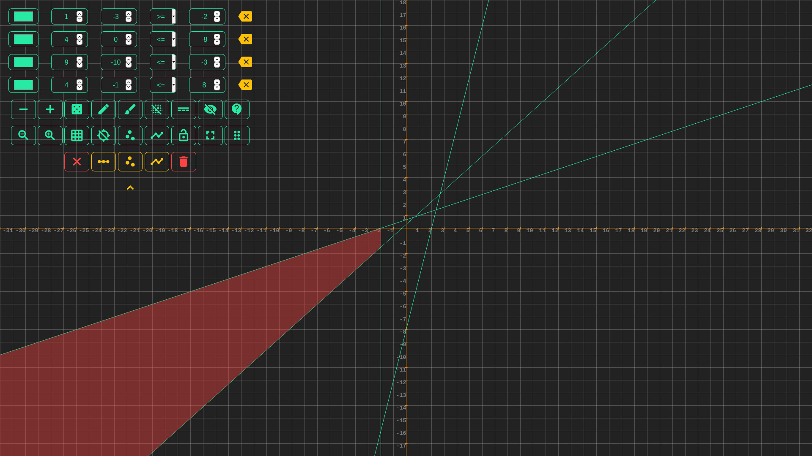

# Linear equation

## В двух словах

Решение задач линейных уравнений с графическим методом.

## Подробнее

Это работа часть одного задания в универе, мне хотелось визуально показать область допустимых значений. Программа может быстро найти область допустимых значений системы линейных уравнений и отрисовать область если решение имеется.

## Где посмотреть?

<https://github.com/exynil/linear-equation>

## Скриншоты

