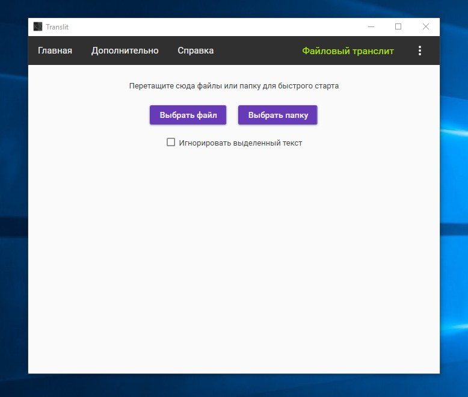
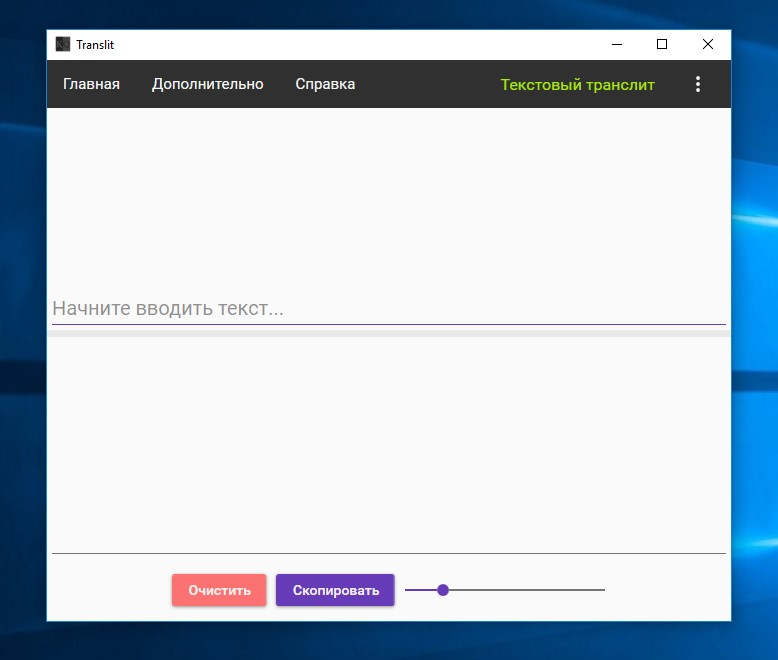

# Translit

## В двух словах

Программа для транслитерации документов.

## Подробее

Программа связана с переходом казахского языка с кириллицы на латиницу. Приложение транслитерирует документы с кирилицы на латиницу.

Поддерживаемые форматы:

- Документы Word: doc, docx

- Таблицы Excel: xls, xlsx

- Презентации Power Point: ppt, pptx

- Документы PDF: pdf

- Документы RTF: rtf

- Текстовые документы: txt

Идея возникла когда услышал от преподавателя о том как им трудно переделывать уже имеющиеся документы, учебные пособия, презентации, силлабусы на казахском языке с кириллицы на латиницу. Пришел домой написал за вечер маленький прототип, решил удивить преподавателя, преподавателю понравилось. И я продолжил расширять программу, ею начали пользоваться на всей кафедре казахского языка, чему я был очень рад. По их словам, программа сделала массу работы, которую было бы трудно делать в ручную. Я даже не подозревал что она сэкономит людям массу времени. Рад что помог людям. К сожелению преподаватель попросил не распространять программу, из-за чего программа не известна вне моего университета, и просто работает локально на кафедре.

## Где посмотреть?

Исходный код недоступен.

## Скриншоты

